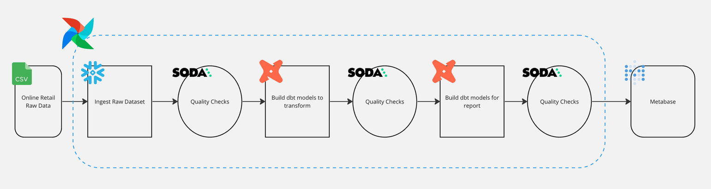
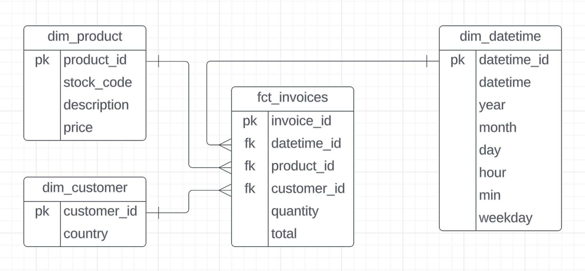

# Data Engineering Project with Retail Data

## Table of Contents

1. [Executive Summary](#executive-summary)
2. [Dataset Description](#dataset-description)

## Executive Summary

The purpose of this project is to create an end-to-end Airflow data pipeline for retail data. The pipeline involves several steps, including loading a CSV file into Google Cloud Storage using the local file system to GCS operator, ingesting the data into BigQuery, creating a dashboard to visualize the data, and performing data quality checks using Soda to ensure the accuracy of the data. Various tools and libraries, including the Astro SDK, DBT, and Soda Python package to automate the data pipeline

## Dataset Description

The source data for this exercise comes from Kaggle and the data can be found on the following link: https://www.kaggle.com/datasets/tunguz/online-retail

#### Source:

Dr Daqing Chen, Director: Public Analytics group. chend '@' lsbu.ac.uk, School of Engineering, London South Bank University, London SE1 0AA, UK.

#### Data Set Information:

This is a transnational data set which contains all the transactions occurring between 01/12/2010 and 09/12/2011 for a UK-based and registered non-store online retail.The company mainly sells unique all-occasion gifts. Many customers of the company are wholesalers.

| Column | Description |
| --- | --- |
| InvoiceNo | Invoice number. Nominal, a 6-digit integral number uniquely assigned to each transaction. If this code starts with letter 'c', it indicates a cancellation. |
| StockCode | Product (item) code. Nominal, a 5-digit integral number uniquely assigned to each distinct product. |
| Description | Product (item) name. Nominal. |
| Quantity | The quantities of each product (item) per transaction. Numeric. |
| InvoiceDate | Invice Date and time. Numeric, the day and time when each transaction was generated. |
| UnitPrice | Unit price. Numeric, Product price per unit in sterling. |
| CustomerID | Customer number. Nominal, a 5-digit integral number uniquely assigned to each customer. |
| Country | Country name. Nominal, the name of the country where each customer resides. |

## Pipeline

Starting from a CSV file the data will be ingested into BigQuery, task orchestrated with Airflow. The next step is to run quality checks on the data using Soda, a data quality framework. Once the checks are done the data, the Data Modelling design takes place. This is done task using dbt to generate the fact and the dimension tables is run.

## Data Modelling

## Prerequisites

- Docker
- Astro CLI
- Soda
- GC account

